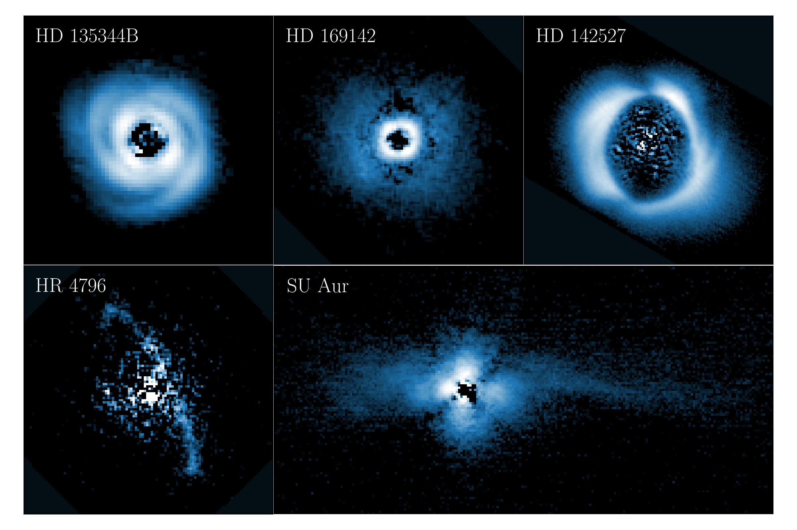

PIPPIN
======

**This documentation is under construction.**

**PIPPIN** (**P**\D\ **I**\  **p**\i\ **p**\el\ **i**\ne for **N**\ACO data) is a pipeline developed to reduce the polarimetric observations made with the `VLT/NACO <https://www.eso.org/sci/facilities/paranal/decommissioned/naco.html>`_ instrument. It applies the Polarimetric Differential Imaging (PDI) technique to distinguish the polarised, scattered light from the (largely) un-polarised, stellar light. As a result, circumstellar dust can be uncovered. During its operation, NACO employed different instrument configurations (e.g. half-wave plate or de-rotator usage, Wollaston beam-splitter or wiregrid observations) which are appropriately handled by PIPPIN. As part of the PDI reduction, PIPPIN performs various levels of corrections for instrumental polarisation and crosstalk.

To reduce polarimetric NACO data, the user can specify a limited number of input parameters and run PIPPIN from a terminal. Subsequently, PIPPIN applies a complete reduction from the raw SCIENCE observations to the final data products in a matter of minutes.

*Examples of NACO observations reduced with PIPPIN.*

A comprehensive archive of the PIPPIN-reduced NACO data products can be found on `Zenodo <https://doi.org/10.5281/zenodo.8348803>`_. There, we have published our reductions of potential young systems observed with any of NACO's polarimetric configurations **paper-citation**. These data include multi-wavelength and multi-epoch observations.

.. note::
   If you use PIPPIN or PIPPIN-reduced data products from the archive for your publication, please :ref:`cite our paper <Citing PIPPIN>`.

Contents
--------

.. toctree::

   Home <self>
   ./source/installation
   ./source/example
   ./source/usage
   ./source/configfile
   GitHub <https://github.com/samderegt/PIPPIN-NACO>
