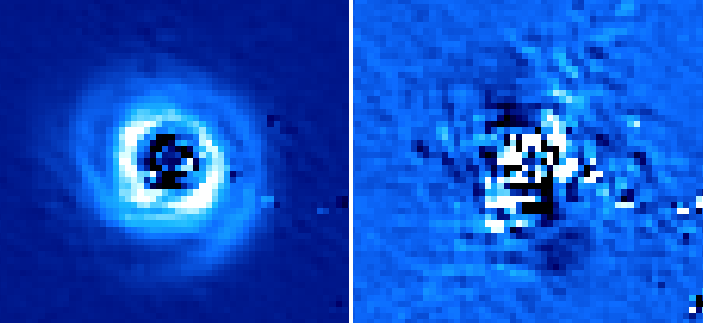

Example reduction
=================

To confirm that the PIPPIN installation was successful and as an introduction to the pipeline, we provide an example reduction of the Ks-band observations of HD 135344B, observed as part of ESO programme 089.C-0611(A). This dataset was previously published in `Garufi et al. (2013) <https://ui.adsabs.harvard.edu/abs/2013A%26A...560A.105G/abstract>`_.

To run the example reduction, navigate to any directory in the terminal and type:
::

   pippin --run_example

PIPPIN attempts to find the required data in your current directory. If these files do not exist, they can be downloaded (with an internet connection) from the `GitHub repository <https://github.com/samderegt/PIPPIN-NACO/tree/master/pippin/example_HD_135344B>`_ (48.4 MB). After successfully downloading the data, which includes SCIENCE, FLAT, and DARK observations, as well as a configuration-file with input parameters (:file:`config.conf`), PIPPIN begins the reduction.

.. note::
   A discussion of the input parameters in :file:`config.conf` can be found :ref:`here <Configuration file>`.

As the pipeline is running, information is printed in the terminal and stored in the :file:`example_HD_135344B/pipeline_output/log.txt` file. First, the FLATs and DARKs are median-combined into master FLATs and master DARKs per observation type. In this example, there is only one calibration observation per type. The master FLATs are normalized to unity. Master bad-pixel masks (BPMs) are created from the non-linear pixel response between FLAT observations with the FLAT-lamp on or off.

The parameters in the configuration-file are read and the SCIENCE observations are grouped by observation type (only one in this example). After DARK-subtraction and FLAT-normalisation, figures are generated in the :file:`example_HD_135344B/pipeline_output/200236070_0.3454_Ks/plots/` directory. These figures are updated once the sky-subtraction is performed and the ordinary and extra-ordinary beams are cropped out. The sky-subtraction is carried out by subtracting an observation with a different dithering-position.

The PDI technique is applied to the cropped-out beams and a series of corrections are performed to mitigate the effects of instrumental polarisation. The final data products are stored in the :file:`example_HD_135344B/pipeline_output/200236070_0.3454_Ks/PDI/` directory. Running the following command within a terminal in the :file:`example_HD_135344B/pipeline_output/200236070_0.3454_Ks/PDI/` directory will show the :math:`Q_\phi` and :math:`U_\phi` images in `DS9 <http://ds9.si.edu/>`_.

::

   ds9 -tile Q_phi.fits -cube 2 -scale limits -10 40 U_phi.fits -cube 2 -scale limits -5 20 -lock frame wcs -lock colorbar yes -cmap cool

The left figure shows the :math:`Q_\phi` image and the right figure displays the :math:`U_\phi` signal. The images above show the result of only 2 HWP cycles and thus have a lower signal-to-noise than the combination of all 16 cycles.

.. hint::
   The parameters in the :ref:`configuration file <Configuration file>` (:file:`config.conf`) can be tweaked to generate different data products. For example, setting `crosstalk_correction = True` and `minimise_U_phi = True` allows PIPPIN to apply a correction for the :ref:`instrumental crosstalk <Instrumental polarisation>` between the linear and circular Stokes parameters. After running `pippin --run_example` again, the :math:`U_\phi` image shows a reduced signal.

In the :ref:`next section <Usage instructions>` we will learn how to reduce other NACO polarimetric datasets.
